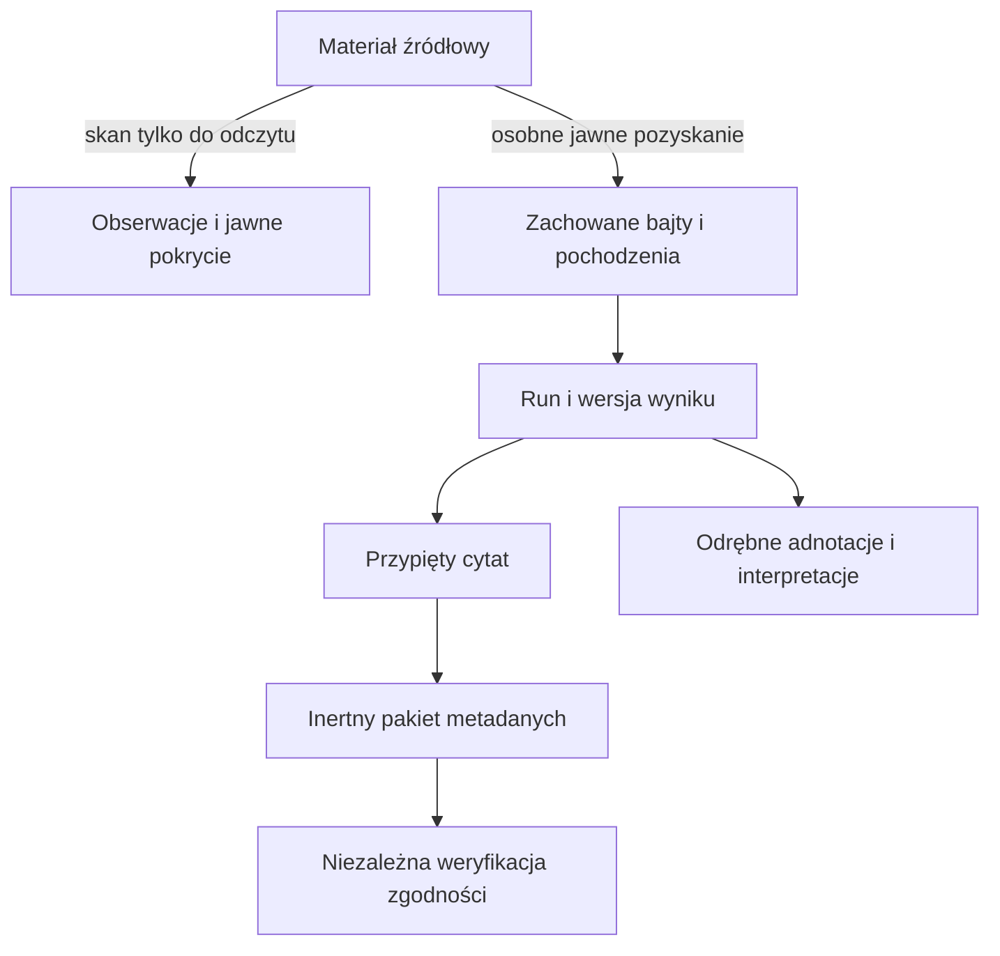

# AGEDS — program trzydziestu ról

Propozycja organizacji rozwoju wynikająca z pierwotnego zlecenia użytkownika,
aktualnego kodu i `docs/ARCHITECTURE_RULES.md`. To **30 ról do obsadzania**, nie
deklaracja 30 uruchomionych procesów. W tej sesji pracują koordynator i najwyżej
sześciu wykonawców jednocześnie. Sześć odpowiedzialności zarządczych rotuje w tej
samej puli; osobny wątek zarządzania nie został tu uruchomiony ani zweryfikowany.

## Cel i granice

AGEDS ma umożliwiać przejście od materiału do sprawdzalnej wypowiedzi o nim,
z zachowaniem różnicy między oryginałem, obserwacją parsera, wynikiem modelu,
cytatem, adnotacją i interpretacją. Ekosystem może korzystać z tych zdolności
bez wspólnej bazy i bez automatycznego dostępu do prywatnych źródeł.

Skan nie jest pozyskaniem kopii. Hash nie dowodzi prawdziwości, autorstwa ani
czasu. Zgodny cytat ASR nie dowodzi alignmentu lub odsłuchu. Inertny pakiet nie
jest live restore, replay ani podpisem. Weryfikator w tym repo nie potwierdza
wdrożenia integracji z ChatADHD, WatchDogiem, iOmatrix lub Loom/LEM.

## Trzydzieści ról i warunki odbioru

Każda rola otrzymuje przed pracą osobny task ID, właściciela plików, bazowy
commit i kryterium. Wiersze opisują proponowane odpowiedzialności; bieżące
przydziały i wykonanie potwierdza `night-20261001.json`.

| Rola | Odpowiedzialność i konkretny wynik | Bramka odbioru |
|---|---|---|
| 01 · Koordynacja | Priorytety, rozłączne przydziały, lease, kolejny checkpoint | Świeży remote HEAD, brak nadpisania aktywnego właściciela |
| 02 · Pochodzenie wymagań | Lokatory decyzji użytkownika, sprzeczności i propozycje | Wniosek agenta nie staje się fikcyjnym wymaganiem użytkownika |
| 03 · Architektura | Kontrakty, jednostki, straty i granice wspólnych mechanizmów | Dwa konkretne zastosowania i przypadek graniczny przed abstrakcją |
| 04 · Priorytety produktu | Kolejka scenariuszy użytkownika i odwracalne decyzje | Każde zadanie usuwa zaobserwowaną lukę lub testuje wskazaną hipotezę |
| 05 · Niezależny odbiór | Krytyka rozwiązania, trudne przypadki, regresje | Test ataku na kontrakt, nie tylko powtórzenie kodu autora |
| 06 · Mapa ekosystemu | Korzyści wymiany, semantyka partnerów i zakres dostępu | Integracja pozostaje propozycją do rzeczywistego testu drugiej strony |
| 07 · SAF | Dostawcy dokumentów, uprawnienia i anulowanie skanu | Brak zapisów do źródła; osobne dowody JVM, kompilacji i telefonu |
| 08 · CSV i tekst | Surowe tokeny, kodowania, separatory i niejednoznaczność | Dokładne dane i jawne błędy; brak cichej naprawy treści |
| 09 · XLS | Ograniczona projekcja CFB/BIFF8, rekordy i lokatory | Budżety, syntetyczne trudne rekordy, jawne unsupported/partial |
| 10 · XLSX | Arkusze XML/ZIP i granice ekspansji | Brak wykonania formuł, zewnętrznych encji i nieograniczonego rozpakowania |
| 11 · WAV i nagrania | Metadane kontenera, zakresy i znaczenie deklaracji nagłówka | Oddzielić odczyt nagłówka od pełnego hasha i walidacji całego pliku |
| 12 · Korelacje źródeł | Kandydaci zgodności nazw, numerów i czasów | Kolizja i konflikt pozostają widoczne z lokatorami obu stron |
| 13 · Pochodzenia bajtów | Tożsamość zawartości oraz osobne pozyskania | Ten sam hash nie usuwa odmiennej historii pozyskania |
| 14 · Kolejka | Claim, heartbeat, retry i fencing publikacji | Spóźniony worker nie publikuje po utracie lease |
| 15 · Adapter ASR | Rzeczywiste wejście, model, parametry i surowy wynik | Oddzielny run; brak modelu lub wersji pozostaje unknown |
| 16 · Znaczniki słów | Indeksy, czasy i dostępność selektora słownego | Nie interpolować brakujących danych ani pewności alignmentu |
| 17 · Cytaty | Dokładny tekst, selektor i konkretna wersja | Nowa transkrypcja nie przepina starego cytatu |
| 18 · Odtwarzanie | Zakres, seek, przerwanie i cykl odtwarzacza | Błędny lub niedostępny zakres nie uruchamia innego fragmentu |
| 19 · Archiwum metadanych | Kanoniczny dokładny roundtrip inertnych rekordów | Zachowane ID, błędy i relacje; żaden historyczny job nie wykonuje się |
| 20 · Producent pakietu | Ograniczony eksport cytatu i jego pochodzenia | Jawne wyłączenia, deterministic digest, brak dostępu do lokatorów |
| 21 · Konsument pakietu | Niezależna walidacja wersji, grafu i selektora | Działa bez importu live bazy, źródeł i modułów producenta |
| 22 · API | Walidacja, statusy, zgodność i stronicowanie | Błąd, brak danych i ograniczone pokrycie mają różne odpowiedzi |
| 23 · Android | Wybór źródła, wersji, cytatu i historii | Stare odpowiedzi po zmianie serwera/materiału nie zmieniają widoku |
| 24 · Przeglądarka | Dokładne ID, literalny tekst i dostępne sterowanie | Bez utraty precyzji i wykonywania HTML źródła; rzeczywisty Chromium |
| 25 · Wyszukiwanie | FTS, składnia, ranking i jawna liczba wyników | Nie zmieniać zapytania po cichu; ograniczenie nie udaje kompletności |
| 26 · Wydajność | Indeksy, bajty, bufory i limity zachowanych danych | Pomiar lub plan zapytania; limit wierszy nie udaje limitu pamięci |
| 27 · Granice zaufania | Wyścigi plików, symlinki, parsery i inertne lokatory | Niezgodne bajty nie są przesyłane ani publikowane jako zgodne wejście |
| 28 · Dane testowe | Syntetyczne trudne korpusy i odtwarzalne fixtures | Żaden test nie wymaga prywatnego korpusu ani jego modyfikacji |
| 29 · Odbiór runtime | Telefon/SAF, realne ASR i przeglądarka | Deklarować wyłącznie wykonany rodzaj próby i zapisać ograniczenia |
| 30 · Wydanie i ciągłość | Małe commity, APK, receipty i handoff | Porównanie HEAD przed publikacją, SHA i zgodność drzewa po niej |

Role 01–06 są odpowiedzialnościami zarządczymi. Nie wymagają sześciu dodatkowych
stałych procesów. Przykładowo recenzent roli 05 wykonuje również konkretny pakiet
testów roli 28, a autor kontraktu 03 może implementować rolę 22.

## Jak sześć slotów wykonuje ten program

Preferowany pakiet ma autora mechanizmu, autora integracji, niezależnego
recenzenta, wykonawcę próby runtime oraz dwie rozłączne prace nad następną
granicą. Koordynator scala pliki wspólne i publikuje. Nie tworzymy zadań tylko
po to, żeby wszystkie sloty były zajęte.

W fali 6 zapisano taki konkretny przydział:

| Slot | Task | Zdolność / dowód |
|---|---|---|
| A | N36 | Zweryfikowany czytnik bajtów dla konsumenta audio |
| B | N37 | Worker przekazuje ten czytnik do ASR |
| C | N38 | Niezależna reprodukcja podmiany i testy odmowy publikacji |
| D | N39 | Rzeczywisty lokalny tiny.en na syntetycznej mowie |
| E | N40 | Agregatowy budżet danych historii Android/przeglądarka |
| F | N41 | Niezależne granice Unicode, rozmiaru, wyścigów i pokrycia |

Po odebraniu wyniku slot bierze następne gotowe zadanie. Czekający na telefon
test nie blokuje pracy możliwej lokalnie, ale jego status nie zmienia się na
wykonany. Aktualne sześć zadań, statusy i następny krok są w indeksie; powyższa
tabela jest przykładem przydziału, a nie wiecznym harmonogramem.

## Osobny wątek zarządzania

Transportem są odczytane commity, stabilne task ID, lease i jawny odbiór wyniku
zgodnie z `README.md` w tym katalogu. Historia czatów pomaga odzyskać kontekst;
nie gwarantuje dostarczenia polecenia, kolejności ani aktualności. Zarządzanie
może proponować kolejkę bez dotykania aktywnych plików implementacji. Rutynowe
decyzje w powierzonym zakresie nie wracają do śpiącego użytkownika.

## Najbliższe bramki rozwoju

1. Domknąć odbiór zweryfikowanego wejścia ASR i limitów klienta z fali 6.
2. Sprawdzić przydatny, ograniczony odczyt nagłówka dużego WAV bez udawania
   pełnego odczytu pliku i bez kopii źródła.
3. Wykonać gotowe testy SAF dopiero przy rzeczywiście dostępnym urządzeniu.
4. Rozszerzać formaty na konkretnych brakujących przypadkach, nie przez listę
   obietnic obsługi wszystkich formatów.
5. Test partnera ekosystemu wymaga osobnego uzgodnionego kontraktu, zakresu
   danych i rzeczywistego konsumenta. W tej nocy praca dotyczy repo AGEDS.

Każdy checkpoint zachowuje dowody testów, niepewności, opublikowaną rewizję
i konkretny następny krok. Zakończenie procesu nie oznacza dalszej pracy w tle.
